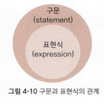

## **04-3 표현식과 구문의 차이**

### **1. 표현식 (Expression)**

- 하나 이상의 변수, 연산자, 리터럴의 조합으로 **값을 평가하고 결과를 반환**하는 코드
- 예: `b + c`, `func()`, `10 > 5`

### **2. 구문 (Statement)**

- 컴파일러가 실행할 수 있는 **최소의 독립적인 코드 조각**이며, 명령을 수행
- 보통 세미콜론(`;`)으로 끝나며, 하나 이상의 표현식을 포함
- 구문은 표현식을 포함하는 더 큰 개념
    
    
    

```cpp
// 구문
#include <iostream>

using namespace std;

int a = 0;
while (true)
{
	++a;
	if(a>10)
		break;
}
```